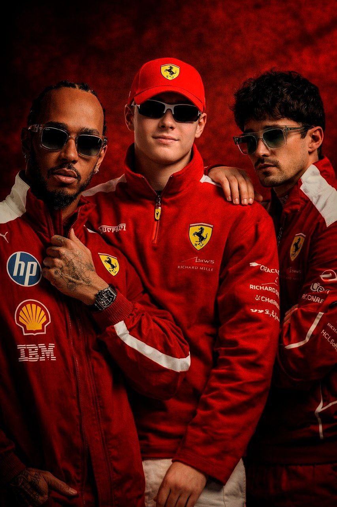

<div align="center">

# 🏎️ F1 Hub — Telegram Mini App

### Всё о Формуле 1 в одном приложении (и даже больше)

[](https://t.me/F1_egor_bot)
[](https://f1.lead-seek.ru)
[](https://python.org)
[](https://react.dev)
[](https://fastapi.tiangolo.com)
[](https://docker.com)
[](/)
[](/)

<br/>



<br/>

*Когда твоё приложение настолько хорошее, что даже Ferrari одобряет* 🤌

**Live тайминги** · **AI Стратегия** · **Телеметрия** · **Радар осадков** · **Прогнозы** · **Чемпионат** · **Новости**

<sub>22 пилота · 11 команд · 24 гонки · 2 сезона · 1 голый Боттас · 47MB RAM · 0 багов (наверное)</sub>

---

</div>

## 🤔 Что это вообще такое?

**F1 Hub** — это когда ты фанат Формулы 1 и тебе мало просто смотреть гонки. Тебе нужно знать что Норрис на 0.003с быстрее Ферстаппена в третьем секторе, какой compound стоит у Хэмилтона, и будет ли дождь через 15 минут.

Всё это — прямо в Telegram. Открыл бота, нажал кнопку, и ты как стратег на пит-уолле. Только без зарплаты в $500k.

> 🏁 **Live позиции** — как будто сидишь в командном штабе
> 🧠 **AI Стратегия** — моделирует пит-стопы (точность примерно как у Ferrari)
> 📻 **Командное радио** — слушай как пилоты ругаются на инженеров
> 🌧 **Радар осадков** — единственное что работает лучше чем у FIA
> 🔮 **Прогнозы** — угадай победителя и докажи что ты умнее букмекеров
> 📰 **Новости** — свежее с championat.com пока ты на работе

---

## 📸 А как оно выглядит?

<div align="center">
<table>
<tr>
<td align="center"><b>🏠 Главная</b><br/><sub>Таймер, чемпионат, ближайшие гонки</sub><br/></td>
<td align="center"><b>🏁 Live</b><br/><sub>Позиции, секторы, шины, погода</sub><br/></td>
<td align="center"><b>🃏 Карточки</b><br/><sub>Все 22 пилота с фото и цветами</sub><br/></td>
</tr>
<tr>
<td align="center"><b>🧠 AI Стратегия</b><br/><sub>5 вариантов пит-стопов, деградация</sub><br/></td>
<td align="center"><b>🌧 Радар</b><br/><sub>RainViewer + погода с трассы</sub><br/></td>
<td align="center"><b>📅 Календарь 2026</b><br/><sub>Флаги, фоны трасс, время МСК</sub><br/></td>
</tr>
<tr>
<td align="center"><b>🏆 Standings</b><br/><sub>Пилоты и конструкторы</sub><br/></td>
<td align="center"><b>📋 Детали ГП</b><br/><sub>Сессии, стратегия, результаты</sub><br/></td>
<td align="center"><b>📅 Сезон 2025</b><br/><sub>Все результаты с фото</sub><br/></td>
</tr>
</table>
</div>

---

## 🚀 Фичи (их много)

### 🏠 Главная
- Карточка следующего ГП с **фоном трассы** и обратным отсчётом
- Ближайшие 5 гонок с флагами стран
- Топ-3 чемпионата с фото
- Переключатель **2025 ↔ 2026** (да, два сезона, мы не ленивые)

### 🏁 Live тайминги
- Позиции пилотов в реальном времени
- Фото с CDN formula1.com (кроп по лицу, а не по ногам)
- Секторы с цветами (зелёный/фиолетовый как в телеке)
- Шины, пит-стопы, радио, погода, дирекция гонки
- Сообщения дирекции **на русском** — 14 точных переводов + 24 паттерна
- **Демо-режим** — работает даже когда нет гонки (а это 90% времени)

### 📊 Аналитика (7 вкладок, да)
| Вкладка | Что делает | Насколько полезно |
|:---|:---|:---|
| 🛞 Шины | Стинты всех пилотов | ⭐⭐⭐⭐⭐ |
| 📈 Позиции | График изменения позиций | ⭐⭐⭐⭐ |
| ⏱ Темпы | Сравнение времён кругов | ⭐⭐⭐⭐ |
| 📉 Деградация | Scatter plot с трендами | ⭐⭐⭐⭐ |
| 🔬 Телеметрия | Speed/throttle/brake двух пилотов | ⭐⭐⭐⭐⭐ |
| 🧠 AI Стратегия | Моделирование пит-стопов | ⭐⭐⭐ (точность Ferrari) |
| 🌧 Радар | Осадки + вероятность дождя | ⭐⭐⭐⭐ |

### 🏆 Чемпионат
- **Пилоты** — standings с большими фото
- **Конструкторы** — per-driver contribution (кто тащит, а кто на пассажирском)
- **Карточки** — сетка 2×11 с фото formula1.com CDN
- **Команды** — фото болидов, лого, пилоты

---

## 🏎 Пилоты 2026

| Команда | Пилот 1 | Пилот 2 | Vibe |
|:---|:---|:---|:---|
| 🟠 McLaren | #1 Norris 🏆 | #81 Piastri | Чемпионы и красавцы |
| 🔵 Red Bull | #3 Verstappen | #6 Hadjar | Макс и новичок |
| 🟢 Mercedes | #63 Russell | #87 Antonelli | PowerPoint King + вундеркинд |
| 🔴 Ferrari | #44 Hamilton | #16 Leclerc | Dream team (наконец-то) |
| 🟢 Aston Martin | #14 Alonso | #18 Stroll | Дед и миллиардер |
| ⚪ Williams | #23 Albon | #55 Sainz | Smooth operators |
| 🔵 Alpine | #10 Gasly | #43 Colapinto | Pierre + аргентинский хаос |
| ⚫ Haas | #31 Ocon | #7 Bearman | Тихий серьёзный тим |
| 🔵 Racing Bulls | #22 Tsunoda | #41 Lindblad | Юки кричит, Арвид едет |
| 🟢 Audi | #27 Hulkenberg | #5 Bortoleto | Подиум? Не, не слышали |
| 🟤 Cadillac | #11 Perez | #77 Bottas 😎 | [см. карточку Боттаса] |

---

## 🛠 Под капотом

```
┌─────────────────────────────────────────────────────┐
│           Telegram Mini App (WebApp)                │
│      React 18 · Babel · SPA · index.html            │
│              "один файл, чтобы править всеми"       │
├─────────────────────────────────────────────────────┤
│            Nginx (SSL · Static · Proxy)             │
│     /static/drivers/77_custom.jpg 😎                │
├─────────────────────────────────────────────────────┤
│              FastAPI Backend (api.py)                │
│      Python 3.11 · Uvicorn · async · ~47MB RAM      │
│         "работает на VPS за $5/мес"                 │
├────────┬──────────┬──────────┬───────────┬──────────┤
│ OpenF1 │ Jolpica  │RainViewer│ VK API    │Formula1  │
│ (live) │(history) │(weather) │(записи)   │(фото)   │
├────────┴──────────┴──────────┴───────────┴──────────┤
│                  SQLite Database                    │
│       users · predictions · games · achievements    │
│            "PostgreSQL дома:"                       │
└─────────────────────────────────────────────────────┘
```

| Что | Чем | Зачем |
|:---|:---|:---|
| 🎨 Фронтенд | React 18 + Babel | Один HTML файл, zero build step |
| ⚡ Бэкенд | FastAPI | Потому что Flask — это прошлый век |
| 🗃 БД | SQLite WAL | Потому что PostgreSQL жрёт RAM |
| 🐳 Деплой | Docker Compose | Потому что "у меня локально работает" |
| 📡 Live | OpenF1 API | Бесплатно и без ключей |
| 📈 История | Jolpica API | Ergast умер, Jolpica живёт |
| 🌧 Погода | RainViewer | Бесплатный радар |
| 🖼 Фото | Formula1.com CDN | Cloudinary творит чудеса |
| 🏳 Флаги | flagcdn.com | Потому что эмодзи-флаги не везде |

---

## ⚡ Запуск за 2 минуты

```bash
# 1. Клонируй
git clone https://github.com/EgorSanko/F1_WEB_APP.git
cd F1_WEB_APP

# 2. Настрой
cp .env.example .env
nano .env  # BOT_TOKEN, WEBAPP_URL, VK_TOKEN

# 3. Запусти
docker compose up -d --build

# 4. Готово. Серьёзно, это всё.
```

---

## 🔧 Как мы впихнули всё в 47MB RAM

| Проблема | Решение | Было → Стало |
|:---|:---|:---|
| `/location` убивал сервер | Заменили на `/position` | 77MB → 46MB |
| Whisper жрал RAM | Groq API (бесплатно) | -500MB |
| Фото пилотов | CDN formula1.com | 0 байт на диске |
| 3000 запросов/сек | Семафор на 3 | Сервер жив |
| Нет live сессии | Демо-режим | Всегда работает |

---

## 🎨 Пасхалки

- 🥚 Фото Боттаса в карточках — **особенное** (если знаешь, знаешь)
- 🥚 Дирекция гонки переведена на русский с любовью
- 🥚 AI стратегия работает с точностью стратегов Ferrari (~50%)
- 🥚 Антиспойлер для тех кто смотрит гонки в понедельник
- 🥚 `"PostgreSQL дома:"` в архитектуре — не баг, а фича

---

## 🤝 Благодарности

- [OpenF1](https://openf1.org) — без вас ничего бы не было
- [Jolpica](https://github.com/jolpica/jolpica-f1) — RIP Ergast, вы достойная замена
- [RainViewer](https://rainviewer.com) — бесплатный радар, вы лучшие
- [Championat.com](https://www.championat.com) — за новости которые мы парсим
- [Formula 1](https://formula1.com) — за CDN с фотками
- [Claude](https://claude.ai) — за написание 90% кода (не шутка)
- Боттас — за вдохновение 😎

---

<div align="center">

### Сделано с ❤️, ☕ и бессонными ночами

[](https://t.me/F1_egor_bot)

<sub>© 2025-2026 F1 Hub · Не аффилирован с Formula 1, FIA, Ferrari или Боттасом</sub>

*"If you no longer go for a gap that exists, you are no longer a racing driver"* — Ayrton Senna
*"Bwoah"* — Kimi Räikkönen

</div>
